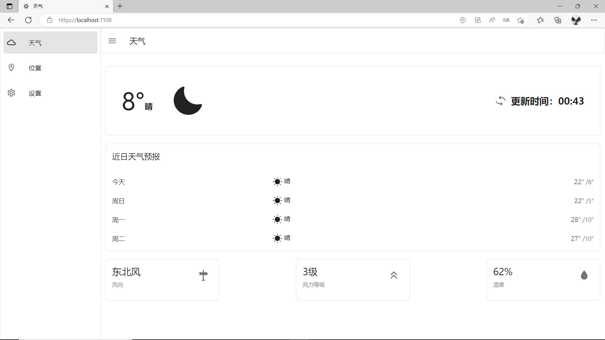
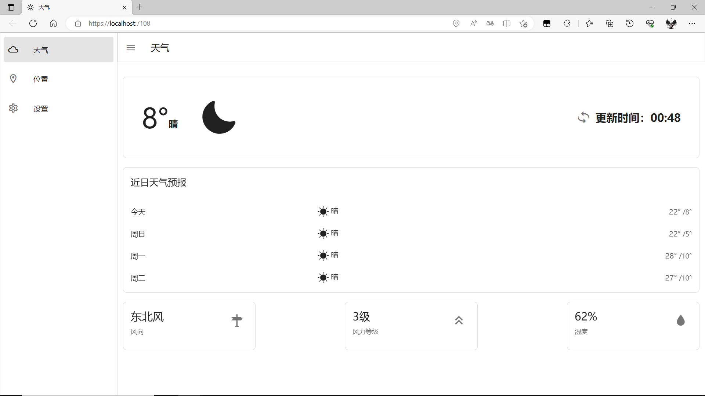
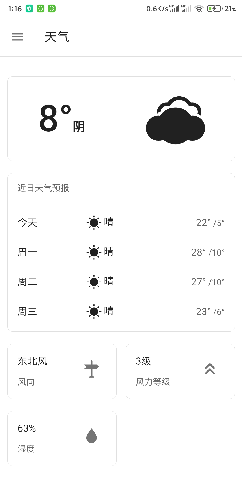
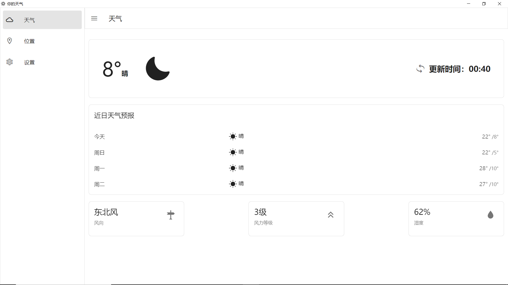
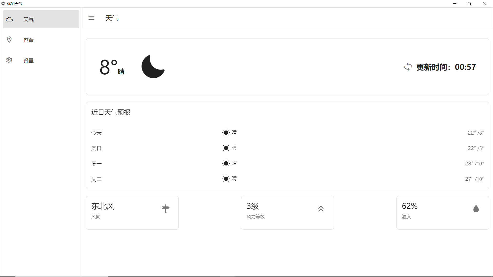
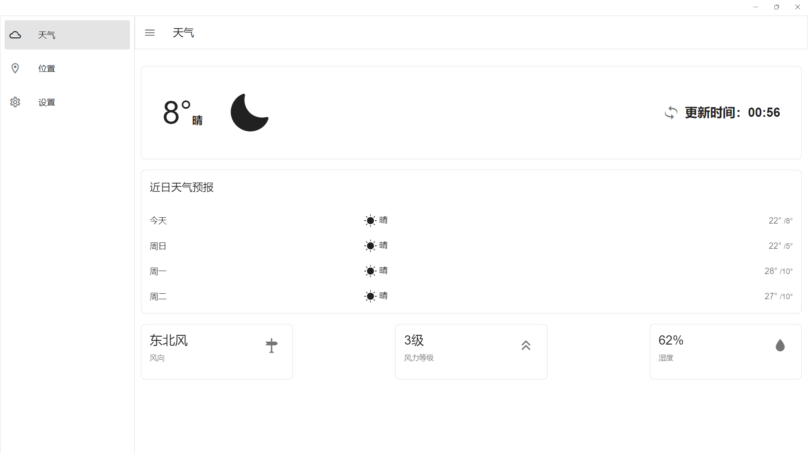

# YourWeather

English | [简体中文](./README.md)

Blazor/Maui Blazor entry-level project, obtains current weather and weather forecasts through weather APIs, has multiple weather sources, and can also select weather from specified locations.

[Live Demo](https://yu-core.github.io/YourWeather/)

## Characteristics
- Support for multiple weather sources
	- AMap
	- OpenWeather
	- QWeather
	- SeniverseWeather
	- VisualCrossing
- Support positioning
	- Through [Darnton. Blazor. DeviceInterop](https://github.com/darnton/BlazorDeviceInterop) Implementation
	- Location permission reference in Maui Blazor [Maui BlazorPermissionsExample](https://github.com/MackinnonBuck/MauiBlazorPermissionsExample )
- Support persistence storage
	- Using LocalStorage in Blazor WebAssembly and Blazor Server
	- Using the preferences provided by Maui in Maui Blazor
	- Using LocalStorage in Winform
	- Using LocalStorage in WPF
- Support for theme switching
	- By [MASA. Blazor](https://github.com/BlazorComponent/MASA.Blazor) Provide
	- Additional support for changing the color of Maui's status bar/title bar
	- Additional support for Winform title bar dark mode
	- Additional support for WPF title bar dark mode
-Support opening external links using default browser
	- Creating a tag through JavaScript in Blazor WebAssembly and Blazor Server
	- Using the API provided by Maui in Maui Blazor
	- Through cmd in Winform and WPF

## Screenshot
<table>
	<tr>
		<td>Blazor WebAssembly</td>
		<td>Blazor Server</td>
		<td>MAUI Android</td>
	</tr>
	<tr>
		<td></td>
		<td></td>
		<td rowspan="3"></td>
	</tr>
	<tr>
		<td>Winform</td>
		<td>WPF</td>
	</tr>
	<tr>
		<td></td>
		<td></td>
	</tr>
	<tr>
		<td>MAUI Windows</td>
	</tr>
	<tr>
		<td></td>
	</tr>
</table>

## Related technologies
- Front end framework: Blazor
- Cross platform UI framework: Maui
- Desktop UI framework: Winform, WPF
- UI component library: Masa Blazor

## Project structure
For details [./YourWeather/README.md](./YourWeather/README.md)

## Supported Platforms
- Web
	- Blazor WebAssembly
	- Blazor Server
- Windows
	- Maui Blazor
	- Winform (Blazor Hybrid)
	- WPF (Blazor Hybrid)
	- Photino Blazor
- Linux
	- Photino Blazor
- Android
	- Maui Blazor
- iOS
	- Maui Blazor
- Mac
	- Maui Blazor
	- Photino Blazor

## Thank you for the following open source projects
- [.NET MAUI]( https://github.com/dotnet/maui )
- [AreaCity-JsSpider-StatsGov]( https://github.com/xiangyuecn/AreaCity-JsSpider-StatsGov )
- [ASP.NET Core]( https://github.com/dotnet/aspnetcore )
- [Blazored.LocalStorage]( https://github.com/Blazored/LocalStorage )
- [Darnton.Blazor.DeviceInterop]( https://github.com/darnton/BlazorDeviceInterop )
- [MASA.Blazor]( https://github.com/BlazorComponent/MASA.Blazor )
- [Masa.Template]( https://github.com/masastack/MASA.Template )
- [MauiBlazorPermissionsExample]( https://github.com/MackinnonBuck/MauiBlazorPermissionsExample )
- [P/Invoke](https://github.com/dotnet/pinvoke)
- [Photino.Blazor](https://github.com/tryphotino/photino.Blazor)
- [QWeather Icons]( https://github.com/qwd/Icons )
> The above rankings are in no particular order
