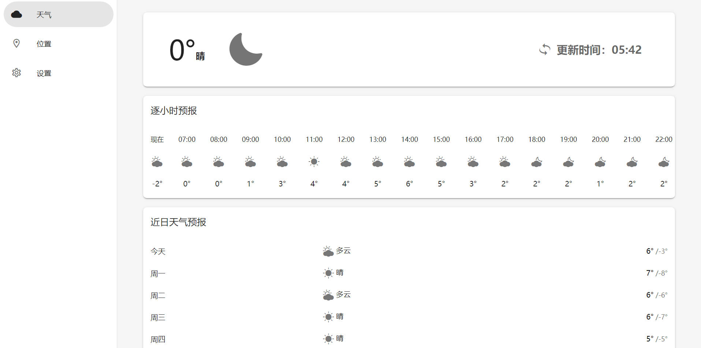
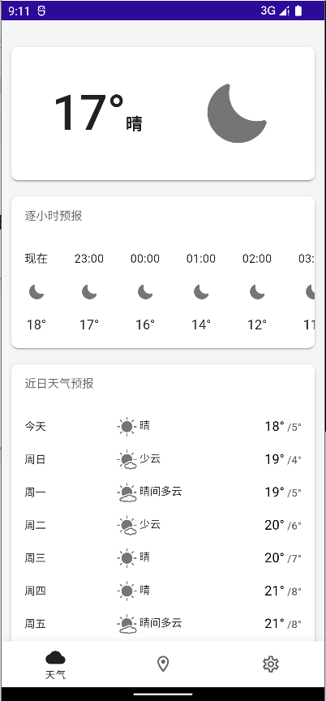

# YourWeather

「YourWeather」是一个支持多平台的天气应用，可以在Web端、桌面端、移动端运行。

   

    

## 信息
- 语言：C#
- 主要技术：Blazor Wasm、MAUI Blazor
- .NET版本：.NET 6

## 支持的平台
- Web
- Windows
- Android
- ~~iOS/Mac~~ (由于没有苹果设备可以测试，能否运行未知)

## 感谢以下开源项目
- [MASA.Blazor](https://github.com/BlazorComponent/MASA.Blazor)
- [ASP.NET Core](https://github.com/dotnet/aspnetcore)
- [.NET MAUI](https://github.com/dotnet/maui)
- [Newtonsoft.Json](https://github.com/JamesNK/Newtonsoft.Json)
- [Swiper](https://github.com/nolimits4web/swiper)
- [Blazored.LocalStorage](https://github.com/Blazored/LocalStorage)
- [Darnton.Blazor.DeviceInterop](https://github.com/darnton/BlazorDeviceInterop)
- [MauiBlazorPermissionsExample](https://github.com/MackinnonBuck/MauiBlazorPermissionsExample)
- [PulltoRefresh.js](https://github.com/BoxFactura/pulltorefresh.js)
- [.NET Runtime](https://github.com/dotnet/runtime)
- [QWeather Icons](https://github.com/qwd/Icons)