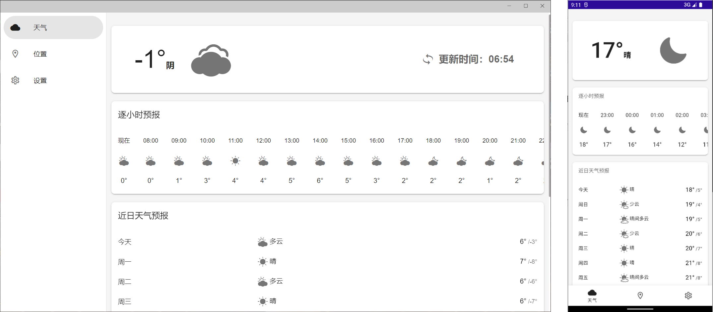

# YourWeather

[English](./README.en.md) | 简体中文

「YourWeather」是一个跨平台的天气应用，可以使用网页、Windows应用、Android应用、iOS应用运行。

也可以将它作为一个学习Blazor和MAUI Blazor的demo（当然由于水平有限，可能写的不是很标准）。

## 技术栈
- 一个纯前端的项目
- 使用了C#、HTML、CSS、JS
- 该项目使用Blazor构建，Blazor WebAssembly和MAUI Blazor共享Razor类库 。Blazor 是一个使用 .NET 生成交互式客户端 Web UI 的框架。
- Web端（Blazor WebAssembly）使用了[Blazored.LocalStorage](https://github.com/Blazored/LocalStorage)把数据存储在localStorage，其他平台（MAUI Blazor）以Json文件形式存储在AppData
- 左右滑动使用了[Swiper](https://github.com/nolimits4web/swiper)
- 下拉刷新使用了[PulltoRefresh.js](https://github.com/BoxFactura/pulltorefresh.js)
- 快捷键使用了[Toolbelt.Blazor.HotKeys](https://github.com/jsakamoto/Toolbelt.Blazor.HotKeys)

## 支持的平台
- Web
- Windows
- Android
- ~~iOS/Mac~~ (由于没有苹果设备可以测试，能否运行未知)

## 缺点与不足
- 安卓系统栏颜色无法随主题变化（MAUI中暂时未集成相应的api）
- 日志功能未实现（水平不足）
- 多语言功能未实现（MAUI中实现较困难）
- iOS未支持（没有iOS设备可以测试）
- 整体结构上有些混乱
- 城市搜索只有中国的城市
- 天气源的key在程序中无法自由更改（未来会完善）

## 感谢以下开源项目
- [MASA.Blazor](https://github.com/BlazorComponent/MASA.Blazor)
- [ASP.NET Core](https://github.com/dotnet/aspnetcore)
- [.NET MAUI](https://github.com/dotnet/maui)
- [Newtonsoft.Json](https://github.com/JamesNK/Newtonsoft.Json)
- [Swiper](https://github.com/nolimits4web/swiper)
- [Blazored.LocalStorage](https://github.com/Blazored/LocalStorage)
- [Darnton.Blazor.DeviceInterop](https://github.com/darnton/BlazorDeviceInterop)
- [MauiBlazorPermissionsExample](https://github.com/MackinnonBuck/MauiBlazorPermissionsExample)
- [PulltoRefresh.js](https://github.com/BoxFactura/pulltorefresh.js)
- [.NET Runtime](https://github.com/dotnet/runtime)
- [QWeather Icons](https://github.com/qwd/Icons)
- [AreaCity-JsSpider-StatsGov](https://github.com/xiangyuecn/AreaCity-JsSpider-StatsGov)
- [CsvHelper](https://github.com/JoshClose/CsvHelper)
- [Loaders.css](https://github.com/ConnorAtherton/loaders.css)
- [Toolbelt.Blazor.HotKeys](https://github.com/jsakamoto/Toolbelt.Blazor.HotKeys)
- [Assets.Dotnet9](https://github.com/dotnet9/Assets.Dotnet9)